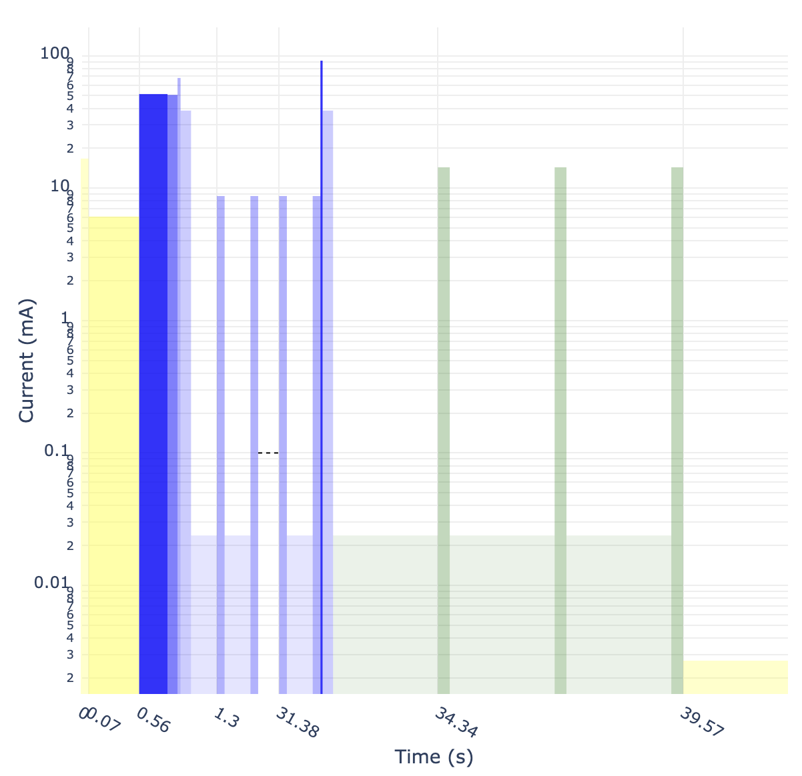

# FP-F24 IoT Venture Pitch

## ESE5180: IoT Wireless, Security, & Scaling

## 1 GitHub URL
<https://github.com/ese5180/fp-f24-iot-venture-pitch-threebot>

## 2 Team Selection

Team Name: ThreeBot

| Team Member Name | Email Address       |
|------------------|---------------------|
| Yuqi Yang         | <yuqiyang@seas.upenn.edu>           |
| Jiarui Li         | <bijiarui@seas.upenn.edu>           |
| Xiang Li         | <xli091@seas.upenn.edu>           |

When will you have your 30-minute weekly team meeting? Every Wednesday after calss.

## 3 Reading & Research

## 4 Concept Development

### 4.1 Target Market & Demographics

#### 4.1.1 Who will be using your product?

E-bike owners who want added safety and security for their e-bike batteries. They could range from daily commuters, delivery service riders, to fleet operators in industries where e-bikes are popular for transportation.

#### 4.1.2 Who will be purchasing your product?

- **Individual E-Bike Owners:** Enthusiasts and safety-conscious individuals who value battery protection and security, wish to avoid the high costs associated with battery replacement, potential fire hazards, and theft-related issues.  
- **E-Bike Battery Manufacturers:** They may bundle the charging protection equipment with their bikes to offer added value and assurance to customers.

#### 4.1.3 Where in the world (or space!) would you deploy your product?

Our primary deployment scenario remains urban areas with Centralized Charging Stations in the Asia-Pacific region, especially cities in China where urban residents frequently rely on e-bikes as primary transportation. Many residential complexes and commercial areas in these regions are adopting centralized charging stations for e-bikes, making it an ideal market for battery protection and security equipment.

Other deployment scenarios include:
- **Multi-modal transit stations:** Public transit hubs or shared mobility stations where e-bike sharing schemes are common, providing protection for multiple bikes charged and parked together.  
- **University and corporate campuses:** These locations often have centralized e-bike charging stations for students and employees, benefiting from equipment that ensures safety, prevents theft, and avoids potential fire hazards.

#### 4.1.4 How large is the market you’re targeting, in US dollars?

According to data from Market Insights by Statista:
- Revenue in the Electric Bicycles market worldwide is forecasted to reach **US$35.96bn by 2024**.  
- The market demonstrates an annual growth rate (CAGR 2024-2029) of 4.17%, leading to a projected market volume of **US$44.10bn by 2029**.  
- Unit sales are expected to hit **49.42m bicycles by 2029**.  
- The volume-weighted average price of electric bicycles in 2024 is expected to be **US$0.83k**.  
- **China** remains the dominant market, with the highest revenue forecasted at **US$11,560m in 2024**, driving innovation and setting industry trends.

#### 4.1.5 How much of that market do you expect to capture, in US dollars?

By 2029, we aim to capture approximately **$123,040,800 USD globally** in the e-bike charging protection equipment market, with around **$43,046,530 USD** coming from China alone.  
This estimate assumes a 10% adoption rate for safety and protection equipment in the electric bicycle market. At a price of **$27.76 per product**, we calculate the capture based on the average e-bike market price and penetration rate.

#### Summary of Changes

1. **New Functions Added:**  
   The product now includes enhanced features, such as:
   - Detecting and alerting users of unauthorized charger removal during charging.  
   - Notifying users of safe unplugging after a full charge.  
   - Monitoring for charging overcurrent, CO2 emissions, and high temperatures, with alerts sent via cellular.  

2. **Pricing Update:**  
   - The cost of the product has been updated to **$27.76 per unit** based on revised component costs and manufacturing efficiency.  

3. **Unchanged Aspects:**  
   - The **target market and demographics** remain the same, focusing on e-bike owners, fleet operators, and battery manufacturers in urban areas.  
   - The **usage scenarios** also remain consistent, targeting centralized charging stations, transit hubs, university campuses, and corporate campuses.  
   - The market size, growth projections, and adoption assumptions have not changed.
     
Most of the original content remains unchanged, reflecting the continued relevance of the product's design and market focus. However, the added features significantly enhance the product's functionality, making it more robust and competitive in the growing e-bike safety and security market.

#### 4.1.6 What competitors are already in the space?

There are two kinds of products which also focus on e-bike battery charging safety: 
  
1. Gate drive DC-DC converter for electric vehicle chargers, such as MGJ1 SIP/MGJ2B provided by Arrows;

<figure>
    
    <figcaption>MGJ1 SIP</figcaption>
</figure>
2. E-bike Smart charging station, such as NP-FCC210-G(4G)/NP-FCC310-G/NP-FCC312-G provided by HikVision.

<figure>
    
    <figcaption>NP-FCC210-G(4G)</figcaption>
</figure>

They have built-in current detection circuit, automatic power off in case of overload, short circuit or other abnormalities. When the electric vehicle socket is unplugged (no rechargeable battery is connected), the socket automatically cuts off power. The devices will automatically shut down when fully charged or when the charging time is up.

### 4.2 Security Requirements Specification

#### 4.2.1 Overview

To ensure the safety, reliability, and integrity of the charging system, the security requirements specify measures to protect data and safeguard communication channels. Key areas include:

1. **Data Integrity and Protection:** All data generated by the charging monitor is encrypted during transmission and storage to prevent unauthorized access. Sensor data is validated to guard against tampering or corruption.
2. **Communication Security:** Secure communication protocols (e.g., HTTPS, TLS) protect data exchanges between the software, alert system, and user’s mobile phone from interception or tampering. Additionally, integrity checks ensure that messages remain unaltered in transit.

#### 4.2.2 Functionality

##### 4.2.2.1 Data Integrity and Protection

* SEC 01 - The software shall encrypt all data transmitted between the charging monitor, alert system, and user’s mobile phone using a secure encryption protocol.
* SEC 02 - The software shall maintain a secure log of sensor data and alerts. This log shall be protected against unauthorized modification or deletion.

##### 4.2.2.2 Communication Security

* SEC 03 - The software shall use a secure communication protocol (e.g., HTTPS, TLS) for all data transmission to prevent interception or tampering.
* SEC 04 - The software shall perform integrity checks on all messages to detect any alterations in transmitted data.
* SEC 05 - The software shall implement an alert confirmation process to verify that alert messages were successfully delivered to the user’s device. If confirmation is not received, the software shall attempt to resend the message.

### 4.3 Hardware Requirements Specification

#### 4.3.1 Overview

Our hardware core is a microcontroller unit (MCU) with cellular functionality, allowing remote monitoring and control. The system can be powered either by an external charger or the electric bike's battery, with a small backup battery providing additional power support. To achieve the required functionality, the hardware is divided into the following modules: Control Module, Sensing Module, and Power Management Module.

#### 4.3.2 Functionality

##### 4.3.2.1 Control Module

* HRS 01 - The software shall be programmed to run on a low-power, cellular-enabled microcontroller.
* HRS 02 - The cellular-enabled microcontroller shall be responsible for sending alerts using a cellular network.

##### 4.3.2.1 Power Management Module

* HRS 03 - A DC-DC buck converter shall handle input voltages from 15V to 50V and provide a regulated 5V output.
* HRS 04 - The system shall use a rechargeable lithium-ion battery with a nominal voltage of 3.7V and a capacity of at least 2000mAh.
* HRS 05 - An additional DC-DC buck converter shall provide a regulated 3.3V output to the system.

##### 4.3.2.2 Sensing Module

* HRS 06 - A power monitor sensor based on the Hall effect, capable of measuring currents up to 30A, voltages up to 36V. The current and voltage measurement result should be reported to the MCU via digital communication.
* HRS 07 - The system shall include a gas sensor capable of detecting the presence of CO2 and combustible gases.
* HRS 08 - The system shall include a temperature and humidity sensor with a temperature range from -40°C to 80°C, a resolution of 0.1°C, and an error margin of ±0.5°C or less.

##### 4.3.2.3 Acturator

* HRS 09 - A transistor switch that can be controlled by the MCU via GPIO to control the on/off of the high voltage charging circuit.

### g4.4 Software Requirements Specification

#### 4.4.1 Overview

The software consists of two main modules:

1. **Charging Management:** Records and monitors temperature, smoke, current, and CO2 gas data through sensors. The system stops charging when the battery is fully charged, a preset time limit is reached, or abnormal conditions are detected.

2. **Alert System:** Sends alert messages to the user’s mobile phone via cellular connection when any of the following events occur: abnormal data detection (e.g., CO2 gas, unusually high temperature or current), unauthorized unplugging during charging, or completion of safe unplugging after full charge.

#### 4.4.2 Users

The users are electric bicycle owners concerned about charging safety, theft prevention, and the integrity of their battery systems.

#### 4.4.3 Functionality

##### 4.4.3.1 Charging Management

1. **Data Recording and Monitoring**
   * SRS 01 - The software shall record temperature, smoke, current, and gas data at every 5 seconds.
   * SRS 02 - The software shall monitor sensor data continuously to identify abnormal values for each parameter.
   * SRS 03 - The software shall maintain a log of collected data along with corresponding timestamps.

2. **Sensor Data Limits**
   * SRS 04 - The temperature sensor shall trigger an alert when temperatures exceed the safe operating range (e.g., 60°C).
   * SRS 05 - The gas sensor shall trigger an alert if CO2 or combustible gases are detected.
   * SRS 06 - The current sensor shall trigger an alert if current exceeds the specified charging threshold.

3. **Charging Termination Conditions**
   * SRS 07 - Charging shall stop under the following conditions:
     * The battery reaches a full charge (100% state of charge).
     * The preset charging time limit (e.g., 4 hours) is reached.
     * Abnormal temperature, gas, or current is detected.

##### 4.4.3.2 Alert System

1. **Event Detection and Alerts**
   * SRS 08 - The software shall send an alert message when abnormal data (temperature, gas, or current) is detected.
   * SRS 09 - The software shall send a warning if the charger is unplugged during charging.
   * SRS 10 - The software shall send a notification upon safe unplugging after full charge.
   * SRS 11 - The software shall send an alert if CO2 gas is detected.

2. **Alert Delivery**
   * SRS 12 - The alert system shall use a cellular connection to deliver messages.
   * SRS 13 - Alerts shall be delivered within 3 seconds of detecting an event.
   * SRS 14 - Unplugged alerts shall be sent no more than once every 30 minutes.

#### Retrospective

**Summary of Changes**

1. **New Functions Added:**
   - Detect unauthorized charger removal during charging and send alerts.
   - Notify users of safe unplugging after a full charge.
   - Detect charging overcurrent and send alerts.
   - Detect CO2 gas emissions and send alerts via cellular.
   - Detect abnormal high temperatures and send alerts via cellular.

2. **Removed Features:**
   - Bluetooth functionality was removed; all communication now relies on cellular connectivity.

3. **Other Enhancements:**
   - Cellular-based alert delivery was optimized for faster response and reliability.
   - Improved sensing capabilities to include CO2 detection and charging overcurrent monitoring. 

These changes were made to enhance safety, improve user experience, and meet emerging market demands.

### 4.5 System Level Diagrams
<figure>
    
    <figcaption>System Block Diagrams</figcaption>
</figure>

### 4.6 Budgeting

#### 4.6.1 Power Budget
<figure>
    
    <figcaption>Power Config</figcaption>
</figure>

<figure>
    
    <figcaption>Power Diagram</figcaption>
</figure>

Total average power consumption is 3.7v * 172.77uA = 639.25 uW.

#### 4.6.2 Hardware Budget

1. [**NRF9160-SICA-B1A-R7: $19.96**](<https://www.digikey.com/en/products/detail/nordic-semiconductor-asa/NRF9160-SICA-B1A-R/13533595?utm_source=oemsecrets&utm_medium=aggregator&utm_campaign=buynow>)
2. [**BME688: $5.01**](<https://www.digikey.com/en/products/detail/bosch-sensortec/BME688/13681261>)
3. [**INA219: $1.01**](<https://www.digikey.com/en/products/detail/texas-instruments/INA219AIDR/1984881>)
4. **PCB Manufacturing Cost: About $1.5**
   

#### 4.6.3 Software Budget

6. **IoT Cellular Service Fee: $0.3 each device per year (provided by Amazon AWS)**
   

#### 4.6.4 Total Budegt(Hardware & Software)

Total price: **$27.76**

## 5 In-Class Pitch

In-Class Pitch Slide link: <https://docs.google.com/presentation/d/1llyvdfKQ1blRosNVRXC3DB5YL2_zz5amqAI0si4eB_U/edit?usp=sharing>

## 6 Fleet Management

**Functionality Demonstration**

1. Demo 1 - Unauthorized Charger Removal Alert During Charge 
[Demo 1 - Unauthorized Charger Removal Alert During Charge](<https://youtu.be/6NRJFWNuwhE>)

2. Demo 2 - Safe Unplugging After Full Charge
[Demo 2 - Safe Unplugging After Full Charge](<https://youtu.be/R4pGHuj-m3U>)

3. Demo 3 - Charging Overcurrent Alert
[Demo 3 - Charging Overcurrent Alert](<https://youtu.be/KU7nm6t14K0>)

4. Demo 4 - Automatic CO₂ Alarm
[Demo 4 - Automatic CO₂ Alarm](<https://youtu.be/5kjaWwp8sTM>)

5. Demo 5 - Charging Temperature Alert
[Demo 5 - Charging Temperature Alert](<https://youtu.be/ADwszu1okLE>)

## 7 Parts ordering
### 7.1 Components

1. SparkFun Environmental Sensor - BME688 (Qwiic)

The SparkFun BME688 Environmental Sensor is a breakout that combines a gas scanning sensor with temperature, humidity, and barometric pressure sensing for a complete environmental sensor in a single package. The gas sensor on the BME688 can detect a wide variety of volatile organic compounds (VOCs), volatile sulfur compounds (VSCs), and other gases such as carbon monoxide and hydrogen in the part per billion (ppb) range. Combine that with precise temperature, humidity, and barometric pressure and the BME688 can work as a completely standalone environmental sensor all in a 1in. x 1in. breakout!
The sensor communicates via either I2C or SPI. We've broken out the I2C pins to our Qwiic system so no soldering is required to connect it to the rest of your system but if you would prefer, both the I2C and SPI pins are also broken out to standard 0.1in.-spaced pins.

link: <https://www.sparkfun.com/products/19096>

2. INA 219

The INA219 is a current shunt and power monitor with an I²C- or SMBUS-compatible interface. The device monitors both shunt voltage drop and bus supply voltage, with programmable conversion times and filtering. A programmable calibration value, combined with an internal multiplier, enables direct readouts of current in amperes. An additional multiplying register calculates power in watts. The I²C- or SMBUS-compatible interface features 16 programmable addresses.
The INA219 is available in two grades: A and B. The B grade version has higher accuracy and higher precision specifications.
The INA219 senses across shunts on buses that can vary from 0 to 26 V. The device uses a single 3- to 5.5-V supply, drawing a maximum of 1 mA of supply current. The INA219 operates from –40°C to 125°C.

link: <https://www.ti.com/product/INA219>

3. Nordic nrf9160 DK

Cellular IoT development kit for LTE-M, NB-IoT, GNSS and Bluetooth LE
The nRF9160 DK is an affordable, pre-certified single-board development kit for evaluation and development on the nRF9160 SiP for LTE-M, NB-IoT and GNSS. It also includes an nRF52840 board controller that for example can be used to build a Bluetooth Low Energy gateway.

link: <https://www.nordicsemi.com/Products/Development-hardware/nRF9160-DK>

### 7.2 Reflections

**What parts of your project would you consider a success? Why?**

The **hardware components** selected for our project were a significant success, as they played a critical role in enabling the functionalities we aimed to achieve. Here’s why:

1. **SparkFun Environmental Sensor - BME688 (Qwiic):**  
   - The BME688 proved to be an excellent choice for our sensing needs. Its precise measurement of temperature, humidity, and barometric pressure ensured accurate data collection.  
   - The availability of a detailed library and documentation made integration into our system smooth and efficient. The I2C communication via the Qwiic system also simplified connectivity, eliminating the need for soldering and saving development time.

2. **INA219 Current Shunt and Power Monitor:**  
   - The INA219's capability to measure both shunt voltage drop and bus supply voltage with high accuracy was instrumental in monitoring charging currents. The programmable calibration and internal multiplier made direct readouts of current in amperes straightforward, enhancing the reliability of our system.  
   - The detailed technical resources and examples provided in the documentation made it easy to implement this sensor, even for complex power monitoring requirements.

3. **Nordic nRF9160 DK Cellular IoT Development Kit:**  
   - The nRF9160 DK was crucial for enabling cellular communication in our system. Its support for LTE-M, NB-IoT, and GNSS ensured reliable alert delivery via cellular networks. The inclusion of a pre-certified SiP reduced development complexities and regulatory concerns.  
   - The detailed and helpful development resources, including examples and a robust software development kit (SDK), greatly facilitated integration and allowed us to focus on developing core functionalities rather than debugging hardware issues.

Overall, the successful integration of these components, coupled with their robust libraries and detailed resources, helped us achieve reliable performance across all key functionalities.

**What parts of your project didn’t go well? Why?**

While the project was largely successful, a few aspects posed challenges:

1. **Transitioning Away from Bluetooth:**  
   - The decision to remove Bluetooth functionality mid-project and rely solely on cellular communication introduced some delays. Although this change simplified the system in the long term, it required adjustments in hardware and software, as initial configurations were based on supporting both communication methods.

2. **Power Budget Adjustments:**  
   - The integration of additional features, such as CO2 sensing and unauthorized unplugging alerts, slightly increased power consumption. Although the system remains efficient, these adjustments required additional optimization efforts to maintain battery life expectations.

Despite these challenges, the robust support and resources provided for the selected components significantly mitigated the difficulties, enabling us to address these issues effectively and stay on track with the project timeline.

## 8 Retrospective

### 8.1 If We Had to Do it Again...

If we had to do it again, we would prioritize a **simplified and streamlined design from the start** by focusing exclusively on cellular communication rather than initially planning for both Bluetooth and cellular. This would save time spent on reconfiguring the communication approach mid-development. Additionally, we would conduct a more thorough **power budget analysis** earlier in the process to anticipate the increased power consumption from added features. Finally, we would allocate more time for prototyping and testing key components, such as the MOSFET alternatives, to avoid late-stage redesigns and ensure smoother integration within the given time and budget constraints.

### 8.2 What Might Be Changed After This Development Cycle

we would consider making some changes to optimize the user interface and overall user experience based on feedback from this development cycle:

**Wireless Communication Protocol:**

Cellular communication was the correct choice, as it provided reliable connectivity and eliminated the need for short-range protocols like Bluetooth. We would not change this aspect.

**Sensors and Actuators:**

The sensors we chose, such as the SparkFun BME688 and INA219, performed well and met our functional requirements. No changes to these components are necessary at this stage.

**User Interface Improvements:**

We would optimize the interface to better align with user expectations by:
*Displaying Charging Progress:* Adding a feature to display the charging percentage in real time to keep users informed.
*Muting Alerts for Authorized Actions:* Introducing an option to mute alerts when the unplugging behavior is made by the user to reduce unnecessary notifications.
*Behavior Logs:* Providing a log of charging and alert events to give users better visibility into past activities and system performance.
*Enhanced Visual Design:* Improving the aesthetics and usability of the interface to make it more intuitive and visually appealing.

